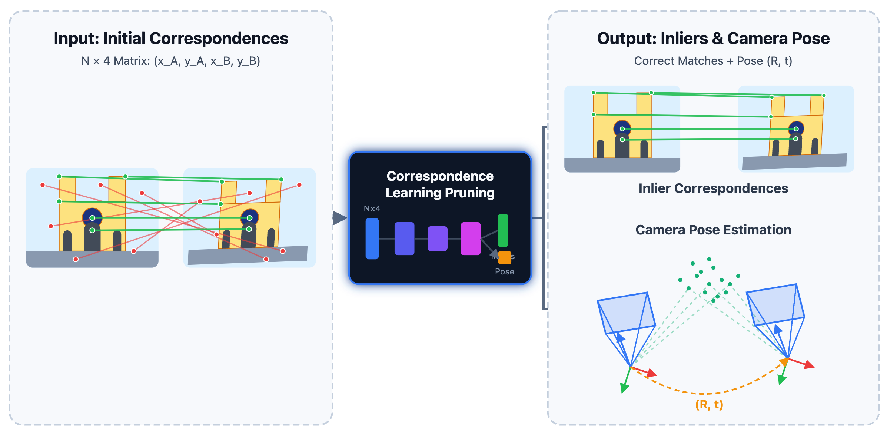

# Correspondence Learning/Pruning

#### 2018
- [LFGC] Learning to Find Good Correspondences, CVPR 2018 [[pdf]](http://openaccess.thecvf.com/content_cvpr_2018/CameraReady/1453.pdf) [[code]](https://github.com/vcg-uvic/learned-correspondence-release) 
- [DFE] Deep fundamental matrix estimation, ECCV 2018 [[code]](https://github.com/isl-org/DFE)
- [N3Net] Neural Nearest Neighbors Networks, NeurIPS 2018 [[code]](https://github.com/visinf/n3net/)
#### 2019
- [OANet] Learning Two-View Correspondences and Geometry Using Order-Aware Network ICCV 2019 [[code]](https://github.com/zjhthu/OANet)
- [NM-Net] NM-Net: Mining Reliable Neighbors for Robust Feature Correspondences, arXiv 2019 [[pdf]](https://arxiv.org/pdf/1904.00320)
- [NG-RANSAC] Neural-Guided RANSAC: Learning Where to Sample Model Hypotheses, ICCV 2019 [[pdf](https://arxiv.org/pdf/1905.04132.pdf)] [[code](https://github.com/vislearn/ngransac)] [[project](https://hci.iwr.uni-heidelberg.de/vislearn/research/neural-guided-ransac/)]
#### 2020
- [ACNe] ACNe: Attentive context normalization for robust permutation-equivariant learning, CVPR 2020[[code]](https://github.com/vcg-uvic/acne)
- [SuperGlue] SuperGlue: Learning Feature Matching with Graph Neural Networks, CVPR 2020 [[code]](https://github.com/magicleap/SuperGluePretrainedNetwork)
#### 2021
- [SGMNet] Learning to Match Features with Seeded Graph Matching Network, ICCV 2021 [[pdf](https://ieeexplore.ieee.org/document/9711340/)]
- [LMCNet] Learnable Motion Coherence for Correspondence Pruning, CVPR 2021 [[code]](https://liuyuan-pal.github.io/LMCNet/)
- [CLNet] Progressive Correspondence Pruning by Consensus Learning, ICCV 2021 [[code]](https://sailor-z.github.io/projects/CLNet)
- [T-Net] T-Net: Effective Permutation-Equivariant Network for Two-View Correspondence Learning, ICCV 2021 [[code]](https://github.com/x-gb/T-Net)
- [GLHA] Cascade Network with Guided Loss and Hybrid Attention for Finding Good Correspondences, AAAI 2021 [[code]](https://github.com/wenbingtao/GLHA)
#### 2022
- [CAT] Correspondence Attention Transformer: A Context-sensitive Network for Two-view Correspondence Learning, TMM 2022 [[code]](https://github.com/jiayi-ma/CorresAttnTransformer)
- [MS2DG-Net] MS2DG-Net: Progressive Correspondence Learning via Multiple Sparse Semantics Dynamic Graph, CVPR 2022 [[code]](https://github.com/changcaiyang/MS2DG-Net)
- [MQ-Net] Learning To Find Good Models in RANSAC, CVPR 2022 [[pdf]](https://openaccess.thecvf.com/content/CVPR2022/papers/Barath_Learning_To_Find_Good_Models_in_RANSAC_CVPR_2022_paper.pdf) [[code]](https://github.com/danini/learning-good-models-in-ransac)
- [CSDA-Net] CSDA-Net: Seeking reliable correspondences by channel-Spatial difference augment network, PR 2022 [[pdf]](https://www.sciencedirect.com/science/article/abs/pii/S0031320322000206)
- [MSA-Net] MSA-Net: Establishing Reliable Correspondences by Multiscale Attention Network, TIP 2022 [[code]](https://github.com/guobaoxiao/MSANet)
#### 2023
- [ConvMatch] ConvMatch: Rethinking Network Design for Two-View Correspondence Learning, AAAI 2023 [[code]](https://github.com/SuhZhang/ConvMatch)
- [NCMNet] Progressive Neighbor Consistency Mining for Correspondence Pruning, CVPR 2023 [[code]](https://github.com/xinliu29/NCMNet)
- [∇-RANSAC] Generalized Differentiable RANSAC, ICCV 2023 [[code]](https://github.com/weitong8591/differentiable_ransac)
- [RLSAC] RLSAC: Reinforcement Learning Enhanced Sample Consensus for End-to-End Robust Estimation, ICCV 2023 [[code]](https://github.com/IRMVLab/RLSAC)
- [U-Match] U-Match: Two-view Correspondence Learning with Hierarchy-aware Local Context Aggregation, IJCAI 2023 [[code]](https://github.com/ZizhuoLi/U-Match)
- [ANANet] Learning Second-Order Attentive Context for Efficient Correspondence Pruning, AAAI 2023 [[code]](https://github.com/DIVE128/ANANet)
- [MSA-Net] Local Consensus Enhanced Siamese Network with Reciprocal Loss for Two-view Correspondence Learning, MM 2023 
- [PGFNet] PGFNet: Preference-Guided Filtering Network for Two-View Correspondence Learning, TIP 2023 [[pdf]](https://ieeexplore.ieee.org/document/10041834/) [[code]](https://github.com/guobaoxiao/PGFNet)
- [JRA-Net] JRA-Net: Joint representation attention network for correspondence learning, PR 2023 [[pdf]](https://www.sciencedirect.com/science/article/abs/pii/S0031320322006598)
#### 2024
- [MaKeGNN] Learning Feature Matching via Matchable Keypoint-Assisted Graph Neural Network, TIP 2024 [[pdf]](http://arxiv.org/abs/2307.01447)
- [DHM-Net] DHM-Net: Deep Hypergraph Modeling  for Robust Feature Matching, TIP 2024 [[code]](https://github.com/CSX777/DHM-Net)
- [ResMatch] ResMatch: Residual Attention Learning for Feature Matching, AAAI 2024 [[code]](https://github.com/ACuOoOoO/ResMatch)
- [GCT-Net] Graph Context Transformation Learning for Progressive Correspondence Pruning, AAAI 2024 [[code]](https://github.com/JunwenGuo/GCT-Net)
- [TrGa] TrGa: Reconsidering the Application of Graph Neural Networks in Two-View Correspondence Pruning, MM 2024 [[code]](https://github.com/Dailuanyuan2024/TrGa2024)
- [CorrMAE] CorrMAE: Pre-training Correspondence Transformers with Masked Autoencoder, arxiv 2024 [[pdf]](https://arxiv.org/pdf/2406.05773)
- [VSFormer] VSFormer: Visual-Spatial Fusion Transformer for Correspondence Pruning, AAAI 2024 [[code]](https://github.com/sugar-fly/VSFormer)
- [MGNet] MGNet: Learning Correspondences via Multiple Graphs, AAAI 2024 [[code]](https://github.com/DAILUANYUAN/MGNet-2024AAAI)
- [BCLNet] BCLNet: Bilateral Consensus Learning for Two-View Correspondence Pruning, AAAI 2024 [[code]](https://github.com/guobaoxiao/BCLNet)
- [MSGSA] Multi-Stage Network With Geometric Semantic Attention for Two-View Correspondence Learning, TIP 2024 [[code]](https://github.com/shuyuanlin/MSGSA)
- [SSL-Net] SSL-Net: Sparse semantic learning for identifying reliable correspondences, PR 2024 [[pdf]](https://www.sciencedirect.com/science/article/abs/pii/S0031320323007367)
- [DeMatch] DeMatch: Deep Decomposition of Motion Field for Two-View Correspondence Learning, CVPR 2024 [[code]](https://github.com/SuhZhang/DeMatch)
- [CorrAdaptor] CorrAdaptor: Adaptive Local Context Learning for Correspondence Pruning, ECAI 2024 [[code]](https://github.com/TaoWangzj/CorrAdaptor)
- [NACNet] Consensus Learning with Deep Sets for Essential Matrix Estimation, NeurIPS 2024 [[code]](https://github.com/drormoran/NACNet)
#### 2025
- [MGCANet] MGCA-Net: Multi-graph contextual attention network for two-view correspondence learning, IJCAI 2025 [[code]](https://github.com/shuyuanlin/MGCANet)
- [DeMo] Deep motion field consensus with learnable kernels for two-view correspondence learning, AAAI 2025 [[code]](https://github.com/JiajunLe/DeMo)
- [MambaMatch] MambaMatch: Establishing Reliable Correspondences via Multi-Scale State Space Model, TIP 2025 [[code]](https://github.com/mxyttkx/MambaMatch)
- [GSLC] Grid-Guided Sparse Laplacian Consensus for Robust Feature Matching, TIP 2025 [[code]](https://github.com/XiaYifan1999/GSLC)
- [CSBCNet] Two-View Correspondence Pruning via Channel-Spatial Interaction and Bidirectional Consensus Interaction, MM 2025 [[code]](https://github.com/jiaowohxg/CSBCNet)
- [CorrNeXt] CorrNeXt: Making the ConvNet-Style Correspondence Pruner Stronger for Two-View Geometry,  MM 2025 [[pdf]](https://dl.acm.org/doi/pdf/10.1145/3746027.3755350)
- [TransMatch] TransMatch: Transformer-based correspondence pruning via local and global consensus, PR 2025 [[code]](https://github.com/lyz8023lyp/TransMatch/)
- [SGNNet] Seed to Prune: A Seeded Graph Neural Network for Two-View Correspondence Learning, TNNLS 2025 [[code]](https://github.com/ZizhuoLi/SGNNet)
- [GeoMoE] GeoMoE: Divide-and-Conquer Motion Field Modeling with Mixture-of-Experts for Two-View Geometry, arxiv 2025
#### 2026
- [LLHA-Net] LLHA-Net: A hierarchical attention network for two-view correspondence learning, PR 2026 [[code]](https://github.com/shuyuanlin?tab=repositories)
- [SC-Net] SC-Net: Robust Correspondence Learning via Spatial and Cross-Channel Context, AAAI 2026 [[code]](https://github.com/shuyuanlin/SCNet)
- [MCD] Monte Carlo Diffusion for Generalizable Learning-Based RANSAC, AAAI 2026 [[code]](https://github.com/comedy0913/MCD)
- [CorrMamba] Selecting and Pruning: A Differentiable Causal Sequentialized State-Space Model for Two-View Correspondence Learning, TIP 2026 [[code]](https://github.com/ShineFox/CorrMamba)

# Related Applications
- Deep Permutation Equivariant Structure From Motion, ICCV 2021 
- RESfM: Robust Deep Equivariant Structure from Motion, ICLR 2025 
- Learning to Filter Outlier Edges in Global SfM, CVPR 2025
- A2-GNN: Angle-Annular GNN for Visual Descriptor-free Camera Relocalization, 3DV 2025
- Solving the Blind Perspective-n-Point Problem End-to-End with Robust Differentiable Geometric Optimization, ECCV 2020
- Is Geometry Enough for Matching in Visual Localization?, ECCV 2022
- DGC-GNN: Leveraging Geometry and Color Cues for Visual Descriptor-Free 2D-3D Matching, CVPR 2024
- MinCD-PnP: Learning 2D-3D Correspondences with Approximate Blind PnP, ICCV 2025
- Learning Bipartite Graph Matching for Robust Visual Localization, ISMAR 2020
- DeepI2P: Image-to-Point Cloud Registration via Deep Classification, CVPR 2021
- P2-Net: Joint Description and Detection of Local Features for Pixel and Point Matching, ICCV 2021  
- 2D3D-MATR: 2D-3D Matching Transformer for Detection-Free Registration Between Images and Point Clouds, ICCV 2023
- EP2P-Loc: End-to-End 3D Point to 2D Pixel Localization for Large-Scale Visual Localization, ICCV 2023
- Learning to Produce Semi-dense Correspondences for Visual Localization, CVPR 2024
- Implicit Correspondence Learning for Image-to-Point Cloud Registration, CVPR 2025
- GraphI2P: Image-to-Point Cloud Registration with Exploring Pattern of Correspondence via Graph Learning, CVPR 2025 
- Diff2I2P: Differentiable Image-to-Point Cloud Registration with Diffusion Prior, ICCV 2025
- OnePose: One-Shot Object Pose Estimation Without CAD Models, CVPR 2022
- OnePose++: Keypoint-Free One-Shot Object Pose Estimation without CAD Models, NeurIPS 2022
- BPnP: End-to-End Learnable Geometric Vision by Backpropagating PnP Optimization, CVPR 2020
- EPro-PnP: Generalized End-to-End Probabilistic Perspective-N-Points for Monocular Object Pose Estimation, CVPR 2022
