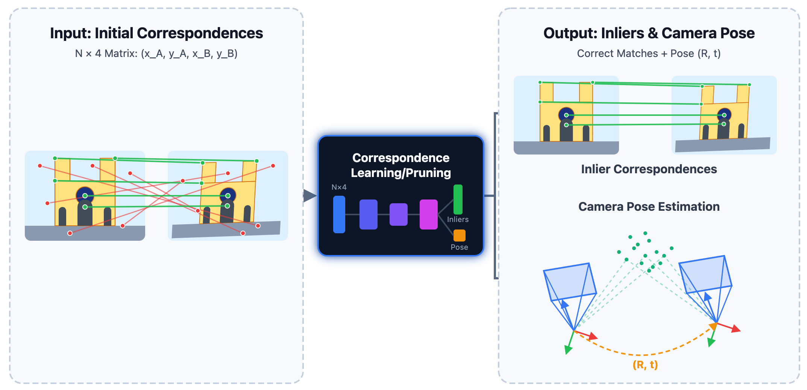

# Correspondence Learning/Pruning

#### 2026

- [ISR-Net] Correspondence Pruning by Iterative Structural Rectification, NeurIPS 2026 (accepted) [[pdf]](https://openreview.net/pdf?id=5J1rwV6KnM) [[paper]](https://neurips.cc/virtual/2026/poster/155477)
- [LLHA-Net] LLHA-Net: A hierarchical attention network for two-view correspondence learning, PR 2026 [[pdf]](https://arxiv.org/pdf/2512.24620) [[DOI]](https://doi.org/10.1016/j.patcog.2025.112896) [[repo]](https://github.com/shuyuanlin?tab=repositories)
- [SC-Net] SC-Net: Robust Correspondence Learning via Spatial and Cross-Channel Context, AAAI 2026 [[pdf]](https://ojs.aaai.org/index.php/AAAI/article/download/37632/41594) [[repo]](https://github.com/shuyuanlin/SCNet)
- [MCD] Monte Carlo Diffusion for Generalizable Learning-Based RANSAC, AAAI 2026 [[pdf]](https://ojs.aaai.org/index.php/AAAI/article/download/37954/41916) [[project]](https://comedy0913.github.io/projects/MCD.html) [[repo]](https://github.com/comedy0913/MCD)
- [CorrMamba] Selecting and Pruning: A Differentiable Causal Sequentialized State-Space Model for Two-View Correspondence Learning, TIP 2026 [[pdf]](https://arxiv.org/pdf/2503.17938) [[DOI]](https://doi.org/10.1109/TIP.2026.3653189) [[repo]](https://github.com/ShineFox/CorrMamba)
- [GeoMoE] GeoMoE: Divide-and-Conquer Motion Field Modeling with Mixture-of-Experts for Two-View Geometry, AAAI 2026 [[pdf]](https://ojs.aaai.org/index.php/AAAI/article/download/37506/41468) [[code]](https://github.com/JiajunLe/GeoMoE)
- [GeneralPruner / CorrMAE] Scalable and Generalizable Correspondence Pruning via Geometry-Consistent Pre-Training, TPAMI 2026 [[pdf]](https://arxiv.org/pdf/2406.05773) [[DOI]](https://doi.org/10.1109/TPAMI.2026.3682079) [[code]](https://github.com/sugar-fly/GeneralPruner)
- [DDFNet] DDFNet: Dual-Neighborhoods Dynamic Fusion Network for Image Feature Matching, TMM 2026 [[pdf]](https://ieeexplore.ieee.org/stamp/stamp.jsp?tp=&arnumber=11420239) [[DOI]](https://doi.org/10.1109/TMM.2026.3668661) [[repo]](https://github.com/1211193023/DDFNet)

#### 2025

- [MGCANet] MGCA-Net: Multi-Graph Contextual Attention Network for Two-View Correspondence Learning, IJCAI 2025 [[pdf]](https://www.ijcai.org/proceedings/2025/0172.pdf) [[code]](https://github.com/shuyuanlin/MGCANet)
- [DeMo] DeMo: Deep Motion Field Consensus with Learnable Kernels for Two-view Correspondence Learning, AAAI 2025 [[pdf]](https://ojs.aaai.org/index.php/AAAI/article/download/32622/34777) [[code]](https://github.com/JiajunLe/DeMo)
- [MambaMatch] MambaMatch: Establishing Reliable Correspondences via Multi-Scale State Space Model, TIP 2025 [[pdf]](https://ieeexplore.ieee.org/stamp/stamp.jsp?tp=&arnumber=11250868) [[code]](https://github.com/mxyttkx/MambaMatch)
- [GSLC] Grid-Guided Sparse Laplacian Consensus for Robust Feature Matching, TIP 2025 [[pdf]](https://ieeexplore.ieee.org/stamp/stamp.jsp?tp=&arnumber=10891339) [[code]](https://github.com/XiaYifan1999/GSLC)
- [CSBCNet] Two-View Correspondence Pruning via Channel-Spatial Interaction and Bidirectional Consensus Interaction, MM 2025 [[pdf]](https://dl.acm.org/doi/pdf/10.1145/3746027.3755581) [[code]](https://github.com/jiaowohxg/CSBCNet)
- [CorrNeXt] CorrNeXt: Making the ConvNet-Style Correspondence Pruner Stronger for Two-View Geometry, MM 2025 [[pdf]](https://dl.acm.org/doi/pdf/10.1145/3746027.3755350)
- [TransMatch] TransMatch: Transformer-based correspondence pruning via local and global consensus, PR 2025 [[pdf]](https://www.sciencedirect.com/science/article/pii/S0031320324008719/pdfft) [[DOI]](https://doi.org/10.1016/j.patcog.2024.111120) [[code]](https://github.com/lyz8023lyp/TransMatch/)
- [SGNNet] Seed to Prune: A Seeded Graph Neural Network for Two-View Correspondence Learning, TNNLS 2025 [[pdf]](https://ieeexplore.ieee.org/stamp/stamp.jsp?tp=&arnumber=10645697) [[code]](https://github.com/ZizhuoLi/SGNNet)
- [HAT-Match] HAT-Match: Graph Transformer with Hybrid Attention for Two-View Correspondence Pruning, ECAI 2025 [[pdf]](https://journals.sagepub.com/doi/pdf/10.3233/FAIA250810) [[code]](https://github.com/gwang-cv/HAT-Match)
- [MaKeGNN] Learning Feature Matching via Matchable Keypoint-Assisted Graph Neural Network, TIP 2025 [[pdf]](https://arxiv.org/pdf/2307.01447)
- [DeMatch++] DeMatch++: Two-View Correspondence Learning via Deep Motion Field Decomposition and Respective Local-Context Aggregation, TPAMI 2025 [[pdf]](https://ieeexplore.ieee.org/stamp/stamp.jsp?tp=&arnumber=11119297) [[code]](https://github.com/SuhZhang/DeMatchPlus)
- [TL-Net] Topology Learning for Two-View Correspondence Filtering, TMM 2025 [[pdf]](https://ieeexplore.ieee.org/stamp/stamp.jsp?tp=&arnumber=11125524)

#### 2024

- [DHM-Net] DHM-Net: Deep Hypergraph Modeling for Robust Feature Matching, TIP 2024 [[pdf]](https://ieeexplore.ieee.org/stamp/stamp.jsp?tp=&arnumber=10720713) [[code]](https://github.com/CSX777/DHM-Net)
- [ResMatch] ResMatch: Residual Attention Learning for Feature Matching, AAAI 2024 [[pdf]](https://ojs.aaai.org/index.php/AAAI/article/download/27915/27852) [[code]](https://github.com/ACuOoOoO/ResMatch)
- [GCT-Net] Graph Context Transformation Learning for Progressive Correspondence Pruning, AAAI 2024 [[pdf]](https://ojs.aaai.org/index.php/AAAI/article/download/27967/27953) [[code]](https://github.com/JunwenGuo/GCT-Net)
- [TrGa] TrGa: Reconsidering the Application of Graph Neural Networks in Two-View Correspondence Pruning, MM 2024 [[pdf]](https://dl.acm.org/doi/pdf/10.1145/3664647.3681139) [[code]](https://github.com/Dailuanyuan2024/TrGa2024)
- [VSFormer] VSFormer: Visual-Spatial Fusion Transformer for Correspondence Pruning, AAAI 2024 [[pdf]](https://ojs.aaai.org/index.php/AAAI/article/download/28123/28250) [[code]](https://github.com/sugar-fly/VSFormer)
- [MGNet] MGNet: Learning Correspondences via Multiple Graphs, AAAI 2024 [[pdf]](https://ojs.aaai.org/index.php/AAAI/article/download/28187/28372) [[code]](https://github.com/DAILUANYUAN/MGNet-2024AAAI)
- [BCLNet] BCLNet: Bilateral Consensus Learning for Two-View Correspondence Pruning, AAAI 2024 [[pdf]](https://ojs.aaai.org/index.php/AAAI/article/download/28218/28431) [[code]](https://github.com/guobaoxiao/BCLNet)
- [MSGSA] Multi-Stage Network With Geometric Semantic Attention for Two-View Correspondence Learning, TIP 2024 [[pdf]](https://ieeexplore.ieee.org/stamp/stamp.jsp?tp=&arnumber=10508303) [[code]](https://github.com/shuyuanlin/MSGSA)
- [SSL-Net] SSL-Net: Sparse semantic learning for identifying reliable correspondences, PR 2024 [[pdf]](https://www.sciencedirect.com/science/article/pii/S0031320323007367/pdfft) [[DOI]](https://doi.org/10.1016/j.patcog.2023.110039) [[code]](https://github.com/guobaoxiao/SSL-Net)
- [DeMatch] DeMatch: Deep Decomposition of Motion Field for Two-View Correspondence Learning, CVPR 2024 [[pdf]](https://openaccess.thecvf.com/content/CVPR2024/papers/Zhang_DeMatch_Deep_Decomposition_of_Motion_Field_for_Two-View_Correspondence_Learning_CVPR_2024_paper.pdf) [[code]](https://github.com/SuhZhang/DeMatch)
- [CorrAdaptor] CorrAdaptor: Adaptive Local Context Learning for Correspondence Pruning, ECAI 2024 [[pdf]](https://arxiv.org/pdf/2408.08134) [[code]](https://github.com/TaoWangzj/CorrAdaptor)
- [NACNet] Consensus Learning with Deep Sets for Essential Matrix Estimation, NeurIPS 2024 [[pdf]](https://proceedings.neurips.cc/paper_files/paper/2024/file/b7f09d26f9b64b5430402860158c2e19-Paper-Conference.pdf) [[code]](https://github.com/drormoran/NACNet)
- [ConvMatch] ConvMatch: Rethinking Network Design for Two-View Correspondence Learning, TPAMI 2024 [[pdf]](https://ieeexplore.ieee.org/stamp/stamp.jsp?tp=&arnumber=10323178) [[code]](https://github.com/SuhZhang/ConvMatch/tree/convmatch_plus)
- [NCMNet+] NCMNet: Neighbor Consistency Mining Network for Two-View Correspondence Pruning, TPAMI 2024 [[pdf]](https://xinliu29.github.io/papers/NCMNet+/TPAMI_liuxin_NCMNet.pdf) [[code]](https://github.com/xinliu29/NCMNet)
- [U-Match] U-Match: Exploring Hierarchy-Aware Local Context for Two-View Correspondence Learning, TPAMI 2024 [[pdf]](https://ieeexplore.ieee.org/stamp/stamp.jsp?tp=&arnumber=10643351)
- [T-Net++] T-Net++: Effective Permutation-Equivariance Network for Two-View Correspondence Pruning, TPAMI 2024 [[pdf]](https://ieeexplore.ieee.org/stamp/stamp.jsp?tp=&arnumber=10637773) [[code]](https://github.com/guobaoxiao/T-Net)

#### 2023

- [ConvMatch] ConvMatch: Rethinking Network Design for Two-View Correspondence Learning, AAAI 2023 [[pdf]](https://ojs.aaai.org/index.php/AAAI/article/download/25456/25228) [[code]](https://github.com/SuhZhang/ConvMatch)
- [NCMNet] Progressive Neighbor Consistency Mining for Correspondence Pruning, CVPR 2023 [[pdf]](https://openaccess.thecvf.com/content/CVPR2023/papers/Liu_Progressive_Neighbor_Consistency_Mining_for_Correspondence_Pruning_CVPR_2023_paper.pdf) [[code]](https://github.com/xinliu29/NCMNet)
- [∇-RANSAC] Generalized Differentiable RANSAC, ICCV 2023 [[pdf]](https://openaccess.thecvf.com/content/ICCV2023/papers/Wei_Generalized_Differentiable_RANSAC_ICCV_2023_paper.pdf) [[code]](https://github.com/weitong8591/differentiable_ransac)
- [RLSAC] RLSAC: Reinforcement Learning enhanced Sample Consensus for End-to-End Robust Estimation, ICCV 2023 [[pdf]](https://openaccess.thecvf.com/content/ICCV2023/papers/Nie_RLSAC_Reinforcement_Learning_Enhanced_Sample_Consensus_for_End-to-End_Robust_Estimation_ICCV_2023_paper.pdf) [[code]](https://github.com/IRMVLab/RLSAC)
- [U-Match] U-Match: Two-view Correspondence Learning with Hierarchy-aware Local Context Aggregation, IJCAI 2023 [[pdf]](https://www.ijcai.org/proceedings/2023/0130.pdf) [[code]](https://github.com/ZizhuoLi/U-Match)
- [ANANet] Learning Second-Order Attentive Context for Efficient Correspondence Pruning, AAAI 2023 [[pdf]](https://ojs.aaai.org/index.php/AAAI/article/download/25431/25203) [[code]](https://github.com/DIVE128/ANANet)
- Local Consensus Enhanced Siamese Network with Reciprocal Loss for Two-view Correspondence Learning, MM 2023 [[pdf]](https://arxiv.org/pdf/2308.03217)
- [PGFNet] PGFNet: Preference-Guided Filtering Network for Two-View Correspondence Learning, TIP 2023 [[pdf]](https://ieeexplore.ieee.org/stamp/stamp.jsp?tp=&arnumber=10041834) [[code]](https://github.com/guobaoxiao/PGFNet)
- [JRA-Net] JRA-Net: Joint representation attention network for correspondence learning, PR 2023 [[pdf]](https://www.sciencedirect.com/science/article/pii/S0031320322006598/pdfft) [[DOI]](https://doi.org/10.1016/j.patcog.2022.109180)
- [CAT] Correspondence Attention Transformer: A Context-Sensitive Network for Two-View Correspondence Learning, TMM 2023 [[pdf]](https://ieeexplore.ieee.org/stamp/stamp.jsp?tp=&arnumber=9741369) [[code]](https://github.com/jiayi-ma/CorresAttnTransformer)

#### 2022

- [MS2DG-Net] MS2DG-Net: Progressive Correspondence Learning via Multiple Sparse Semantics Dynamic Graph, CVPR 2022 [[pdf]](https://openaccess.thecvf.com/content/CVPR2022/papers/Dai_MS2DG-Net_Progressive_Correspondence_Learning_via_Multiple_Sparse_Semantics_Dynamic_Graph_CVPR_2022_paper.pdf) [[code]](https://github.com/changcaiyang/MS2DG-Net)
- [MQ-Net] Learning to Find Good Models in RANSAC, CVPR 2022 [[pdf]](https://openaccess.thecvf.com/content/CVPR2022/papers/Barath_Learning_To_Find_Good_Models_in_RANSAC_CVPR_2022_paper.pdf) [[code]](https://github.com/danini/learning-good-models-in-ransac)
- [CSDA-Net] CSDA-Net: Seeking reliable correspondences by channel-Spatial difference augment network, PR 2022 [[pdf]](https://www.sciencedirect.com/science/article/pii/S0031320322000206/pdfft) [[DOI]](https://doi.org/10.1016/j.patcog.2022.108539)
- [MSA-Net] MSA-Net: Establishing Reliable Correspondences by Multiscale Attention Network, TIP 2022 [[pdf]](https://guobaoxiao.github.io/papers/TIP2022b%281%29.pdf) [[code]](https://github.com/guobaoxiao/MSANet)
- [OANet] OANet: Learning Two-View Correspondences and Geometry Using Order-Aware Network, TPAMI 2022 [[pdf]](https://ieeexplore.ieee.org/stamp/stamp.jsp?tp=&arnumber=9310246) [[code]](https://github.com/zjhthu/OANet)
- [CSR-Net] CSR-Net: Learning Adaptive Context Structure Representation for Robust Feature Correspondence, TIP 2022 [[pdf]](https://ieeexplore.ieee.org/stamp/stamp.jsp?tp=&arnumber=9758641)

#### 2021

- [SGMNet] Learning to Match Features with Seeded Graph Matching Network, ICCV 2021 [[pdf]](https://openaccess.thecvf.com/content/ICCV2021/papers/Chen_Learning_To_Match_Features_With_Seeded_Graph_Matching_Network_ICCV_2021_paper.pdf)
- [LMCNet] Learnable Motion Coherence for Correspondence Pruning, CVPR 2021 [[pdf]](https://openaccess.thecvf.com/content/CVPR2021/papers/Liu_Learnable_Motion_Coherence_for_Correspondence_Pruning_CVPR_2021_paper.pdf) [[code]](https://liuyuan-pal.github.io/LMCNet/)
- [CLNet] Progressive Correspondence Pruning by Consensus Learning, ICCV 2021 [[pdf]](https://openaccess.thecvf.com/content/ICCV2021/papers/Zhao_Progressive_Correspondence_Pruning_by_Consensus_Learning_ICCV_2021_paper.pdf) [[code]](https://sailor-z.github.io/projects/CLNet)
- [T-Net] T-Net: Effective Permutation-Equivariant Network for Two-View Correspondence Learning, ICCV 2021 [[pdf]](https://openaccess.thecvf.com/content/ICCV2021/papers/Zhong_T-Net_Effective_Permutation-Equivariant_Network_for_Two-View_Correspondence_Learning_ICCV_2021_paper.pdf) [[code]](https://github.com/x-gb/T-Net)
- [GLHA] Cascade Network with Guided Loss and Hybrid Attention for Finding Good Correspondences, AAAI 2021 [[pdf]](https://ojs.aaai.org/index.php/AAAI/article/download/16198/16005) [[code]](https://github.com/wenbingtao/GLHA)

#### 2020

- [ACNe] ACNe: Attentive Context Normalization for Robust Permutation-Equivariant Learning, CVPR 2020 [[pdf]](https://theialab.ca/pubs/sun2020acne.pdf) [[code]](https://github.com/vcg-uvic/acne)
- [SuperGlue] SuperGlue: Learning Feature Matching With Graph Neural Networks, CVPR 2020 [[pdf]](https://arxiv.org/pdf/1911.11763) [[code]](https://github.com/magicleap/SuperGluePretrainedNetwork)

#### 2019

- [OANet] Learning Two-View Correspondences and Geometry Using Order-Aware Network, ICCV 2019 [[pdf]](https://arxiv.org/pdf/1908.04964) [[code]](https://github.com/zjhthu/OANet)
- [NM-Net] NM-Net: Mining Reliable Neighbors for Robust Feature Correspondences, CVPR 2019 [[pdf]](https://openaccess.thecvf.com/content_CVPR_2019/papers/Zhao_NM-Net_Mining_Reliable_Neighbors_for_Robust_Feature_Correspondences_CVPR_2019_paper.pdf) [[code]](https://github.com/sailor-z/NM-Net)
- [NG-RANSAC] Neural-Guided RANSAC: Learning Where to Sample Model Hypotheses, ICCV 2019 [[pdf]](https://arxiv.org/pdf/1905.04132) [[code]](https://github.com/vislearn/ngransac) [[project]](https://hci.iwr.uni-heidelberg.de/vislearn/research/neural-guided-ransac/)

#### 2018

- [LFGC] Learning to Find Good Correspondences, CVPR 2018 [[pdf]](https://openaccess.thecvf.com/content_cvpr_2018/papers/Yi_Learning_to_Find_CVPR_2018_paper.pdf) [[code]](https://github.com/vcg-uvic/learned-correspondence-release)
- [DFE] Deep Fundamental Matrix Estimation, ECCV 2018 [[pdf]](https://openaccess.thecvf.com/content_ECCV_2018/papers/Rene_Ranftl_Deep_Fundamental_Matrix_ECCV_2018_paper.pdf) [[code]](https://github.com/isl-org/DFE)
- [N3Net] Neural Nearest Neighbors Networks, NeurIPS 2018 [[pdf]](https://papers.nips.cc/paper/2018/file/f0e52b27a7a5d6a1a87373dffa53dbe5-Paper.pdf) [[code]](https://github.com/visinf/n3net/)

# Related Applications

- [RANSAC Scoring] RANSAC Scoring Done Right, NeurIPS 2026 (accepted) [[pdf]](https://arxiv.org/pdf/2606.27385) [[paper]](https://arxiv.org/abs/2606.27385) [[OpenReview]](https://openreview.net/forum?id=BK5yH67CQC)
- [WAM] WovenAnchor Matcher: Specialized Intra- and Inter-Image Context Modeling for Feature Matching, NeurIPS 2026 (accepted) [[pdf]](https://openreview.net/pdf?id=1tYCWPWHHq) [[paper]](https://neurips.cc/virtual/2026/poster/155912)
- [Ex-Sim(3)-Reg] Ex-Sim(3)-Reg: 2D-3D Correspondence Pruning via Extended Sim(3) Registration, ECCV 2026 [[pdf]](https://arxiv.org/pdf/2608.28096) [[paper]](https://arxiv.org/abs/2608.28096) [[code]](https://github.com/anpei96/ex-sim3-demo)
- [SAG-GNN] SAG-GNN: Semantic-Aware Guided GNN for Descriptor-Free 2D-3D Matching, CVPR 2026 [[pdf]](https://openaccess.thecvf.com/content/CVPR2026/papers/Zhang_SAG-GNN_Semantic-Aware_Guided_GNN_for_Descriptor-Free_2D-3D_Matching_CVPR_2026_paper.pdf) [[paper]](https://openaccess.thecvf.com/content/CVPR2026/html/Zhang_SAG-GNN_Semantic-Aware_Guided_GNN_for_Descriptor-Free_2D-3D_Matching_CVPR_2026_paper.html) [[code]](https://github.com/tinxu0203/SAG-GNN)
- [Loc²] Loc²: Interpretable Cross-View Localization via Depth-Lifted Local Feature Matching, ICLR 2026 [[pdf]](https://arxiv.org/pdf/2509.09792) [[paper]](https://proceedings.iclr.cc/paper_files/paper/2026/hash/ac895e51849bfc99ae25e054fd4c2eda-Abstract-Conference.html) [[code]](https://github.com/vita-epfl/Loc2)
- [C3PO] C3PO: Canonicalization of 3D Pose from Partial Views With Generalizable Correspondence Features, 3DV 2026 [[pdf]](https://ieeexplore.ieee.org/stamp/stamp.jsp?tp=&arnumber=11533341) [[DOI]](https://doi.org/10.1109/3DV69130.2026.00062)
- [SAE] Boosting Correspondence Learning with Structure-Aware Estimator, ECCV 2026 [[pdf]](https://media.eventhosts.cc/Conferences/ECCV2026/pdfs/7836.pdf) [[paper]](https://eccv.ecva.net/virtual/2026/poster/4879) [[code]](https://github.com/Tianyu-Yan/SAE)
- [CFM / ECFM] Collaborative Feature Matching with Progressive Correspondence Learning, AAAI 2026 [[pdf]](https://ojs.aaai.org/index.php/AAAI/article/download/37669/41631) [[code]](https://github.com/xinliu29/CFM)
- [SLiM] Scalable Feature Matching via State Space Modeling and Sparse Correlation, CVPR 2026 [[pdf]](https://openaccess.thecvf.com/content/CVPR2026/papers/Choo_Scalable_Feature_Matching_via_State_Space_Modeling_and_Sparse_Correlation_CVPR_2026_paper.pdf) [[paper]](https://openaccess.thecvf.com/content/CVPR2026/html/Choo_Scalable_Feature_Matching_via_State_Space_Modeling_and_Sparse_Correlation_CVPR_2026_paper.html) [[code]](https://github.com/Band-127/SLiM)
- [TextFM] TextFM: Robust Semi-dense Feature Matching with Language Guidance, CVPR 2026 [[pdf]](https://openaccess.thecvf.com/content/CVPR2026/papers/Zheng_TextFM_Robust_Semi-dense_Feature_Matching_with_Language_Guidance_CVPR_2026_paper.pdf) [[paper]](https://openaccess.thecvf.com/content/CVPR2026/html/Zheng_TextFM_Robust_Semi-dense_Feature_Matching_with_Language_Guidance_CVPR_2026_paper.html)
- [MV-RoMa] MV-RoMa: From Pairwise Matching into Multi-View Track Reconstruction, CVPR 2026 [[pdf]](https://openaccess.thecvf.com/content/CVPR2026/papers/Lee_MV-RoMa_From_Pairwise_Matching_into_Multi-View_Track_Reconstruction_CVPR_2026_paper.pdf) [[paper]](https://openaccess.thecvf.com/content/CVPR2026/html/Lee_MV-RoMa_From_Pairwise_Matching_into_Multi-View_Track_Reconstruction_CVPR_2026_paper.html)
- [UniCorrn] UniCorrn: Unified Correspondence Transformer Across 2D and 3D, CVPR 2026 [[pdf]](https://openaccess.thecvf.com/content/CVPR2026/papers/Goswami_UniCorrn_Unified_Correspondence_Transformer_Across_2D_and_3D_CVPR_2026_paper.pdf) [[paper]](https://openaccess.thecvf.com/content/CVPR2026/html/Goswami_UniCorrn_Unified_Correspondence_Transformer_Across_2D_and_3D_CVPR_2026_paper.html) [[code]](https://github.com/neu-vi/UniCorrn)
- [LoMa] LoMa: Local Feature Matching Revisited, ECCV 2026 [[pdf]](https://media.eventhosts.cc/Conferences/ECCV2026/pdfs/4391.pdf) [[paper]](https://eccv.ecva.net/virtual/2026/poster/4073) [[project]](https://davnords.com/loma) [[code]](https://github.com/davnords/LoMa)
- [RoMa v2] RoMa V2: Harder Better Faster Denser Feature Matching, ECCV 2026 [[pdf]](https://media.eventhosts.cc/Conferences/ECCV2026/pdfs/3897.pdf) [[paper]](https://eccv.ecva.net/virtual/2026/poster/3967)
- [AnyMatch] AnyMatch: Supercharging Universal Multi-modal Image Matching with Large-Scale Single-View Images, ECCV 2026 [[pdf]](https://media.eventhosts.cc/Conferences/ECCV2026/pdfs/10082.pdf) [[paper]](https://eccv.ecva.net/virtual/2026/poster/5344)
- [SemLight] SemLight: Distilled Semantic–Geometric Fusion for Efficient Local Feature Matching, ECCV 2026 [[pdf]](https://media.eventhosts.cc/Conferences/ECCV2026/pdfs/10313.pdf) [[paper]](https://eccv.ecva.net/virtual/2026/poster/5382)
- [Match-Any-Events] Match-Any-Events: Zero-Shot Motion-Robust Feature Matching Across Wide Baselines for Event Cameras, ECCV 2026 [[pdf]](https://media.eventhosts.cc/Conferences/ECCV2026/pdfs/8096.pdf) [[paper]](https://eccv.ecva.net/virtual/2026/poster/4933) [[code]](https://github.com/spikelab-jhu/Match-Any-Events)
- RESfM: Robust Deep Equivariant Structure from Motion, ICLR 2025 [[pdf]](https://proceedings.iclr.cc/paper_files/paper/2025/file/2c487f8a54cf24c0684c32abc77fed56-Paper-Conference.pdf)
- Learning to Filter Outlier Edges in Global SfM, CVPR 2025 [[pdf]](https://openaccess.thecvf.com/content/CVPR2025/papers/Damblon_Learning_to_Filter_Outlier_Edges_in_Global_SfM_CVPR_2025_paper.pdf)
- A2-GNN: Angle-Annular GNN for Visual Descriptor-Free Camera Relocalization, 3DV 2025 [[pdf]](https://arxiv.org/pdf/2502.20036)
- MinCD-PnP: Learning 2D-3D Correspondences with Approximate Blind PnP, ICCV 2025 [[pdf]](https://openaccess.thecvf.com/content/ICCV2025/papers/An_MinCD-PnP_Learning_2D-3D_Correspondences_with_Approximate_Blind_PnP_ICCV_2025_paper.pdf)
- Implicit Correspondence Learning for Image-to-Point Cloud Registration, CVPR 2025 [[pdf]](https://openaccess.thecvf.com/content/CVPR2025/papers/Li_Implicit_Correspondence_Learning_for_Image-to-Point_Cloud_Registration_CVPR_2025_paper.pdf)
- GraphI2P: Image-to-Point Cloud Registration with Exploring Pattern of Correspondence via Graph Learning, CVPR 2025 [[pdf]](https://openaccess.thecvf.com/content/CVPR2025/papers/Bie_GraphI2P_Image-to-Point_Cloud_Registration_with_Exploring_Pattern_of_Correspondence_via_CVPR_2025_paper.pdf)
- Diff2I2P: Differentiable Image-to-Point Cloud Registration with Diffusion Prior, ICCV 2025 [[pdf]](https://openaccess.thecvf.com/content/ICCV2025/papers/Mu_Diff2I2P_Differentiable_Image-to-Point_Cloud_Registration_with_Diffusion_Prior_ICCV_2025_paper.pdf)
- DGC-GNN: Leveraging Geometry and Color Cues for Visual Descriptor-Free 2D-3D Matching, CVPR 2024 [[pdf]](https://openaccess.thecvf.com/content/CVPR2024/papers/Wang_DGC-GNN_Leveraging_Geometry_and_Color_Cues_for_Visual_Descriptor-Free_2D-3D_CVPR_2024_paper.pdf)
- Learning to Produce Semi-Dense Correspondences for Visual Localization, CVPR 2024 [[pdf]](https://openaccess.thecvf.com/content/CVPR2024/papers/Giang_Learning_to_Produce_Semi-dense_Correspondences_for_Visual_Localization_CVPR_2024_paper.pdf)
- 2D3D-MATR: 2D-3D Matching Transformer for Detection-free Registration between Images and Point Clouds, ICCV 2023 [[pdf]](https://openaccess.thecvf.com/content/ICCV2023/papers/Li_2D3D-MATR_2D-3D_Matching_Transformer_for_Detection-Free_Registration_Between_Images_and_ICCV_2023_paper.pdf)
- EP2P-Loc: End-to-End 3D Point to 2D Pixel Localization for Large-Scale Visual Localization, ICCV 2023 [[pdf]](https://openaccess.thecvf.com/content/ICCV2023/papers/Kim_EP2P-Loc_End-to-End_3D_Point_to_2D_Pixel_Localization_for_Large-Scale_ICCV_2023_paper.pdf)
- Is Geometry Enough for Matching in Visual Localization?, ECCV 2022 [[pdf]](https://www.ecva.net/papers/eccv_2022/papers_ECCV/papers/136700402.pdf)
- OnePose: One-Shot Object Pose Estimation without CAD Models, CVPR 2022 [[pdf]](https://openaccess.thecvf.com/content/CVPR2022/papers/Sun_OnePose_One-Shot_Object_Pose_Estimation_Without_CAD_Models_CVPR_2022_paper.pdf)
- OnePose++: Keypoint-Free One-Shot Object Pose Estimation Without CAD Models, NeurIPS 2022 [[pdf]](https://papers.neurips.cc/paper_files/paper/2022/file/e43f900f571de6c96a70d5724a0fb565-Paper-Conference.pdf)
- EPro-PnP: Generalized End-to-End Probabilistic Perspective-n-Points for Monocular Object Pose Estimation, CVPR 2022 [[pdf]](https://openaccess.thecvf.com/content/CVPR2022/papers/Chen_EPro-PnP_Generalized_End-to-End_Probabilistic_Perspective-N-Points_for_Monocular_Object_Pose_Estimation_CVPR_2022_paper.pdf)
- [NeFSAC] NeFSAC: Neurally Filtered Minimal Samples, ECCV 2022 [[pdf]](https://www.ecva.net/papers/eccv_2022/papers_ECCV/papers/136920350.pdf) [[code]](https://github.com/cavalli1234/NeFSAC)
- Deep Permutation Equivariant Structure from Motion, ICCV 2021 [[pdf]](https://openaccess.thecvf.com/content/ICCV2021/papers/Moran_Deep_Permutation_Equivariant_Structure_From_Motion_ICCV_2021_paper.pdf)
- DeepI2P: Image-to-Point Cloud Registration via Deep Classification, CVPR 2021 [[pdf]](https://openaccess.thecvf.com/content/CVPR2021/papers/Li_DeepI2P_Image-to-Point_Cloud_Registration_via_Deep_Classification_CVPR_2021_paper.pdf)
- P2-Net: Joint Description and Detection of Local Features for Pixel and Point Matching, ICCV 2021 [[pdf]](https://openaccess.thecvf.com/content/ICCV2021/papers/Wang_P2-Net_Joint_Description_and_Detection_of_Local_Features_for_Pixel_ICCV_2021_paper.pdf)
- Solving the Blind Perspective-n-Point Problem End-to-End with Robust Differentiable Geometric Optimization, ECCV 2020 [[pdf]](https://www.ecva.net/papers/eccv_2020/papers_ECCV/papers/123470239.pdf)
- Learning Bipartite Graph Matching for Robust Visual Localization, ISMAR 2020 [[pdf]](https://ieeexplore.ieee.org/stamp/stamp.jsp?tp=&arnumber=9284705)
- [BPnP] End-to-End Learnable Geometric Vision by Backpropagating PnP Optimization, CVPR 2020 [[pdf]](https://openaccess.thecvf.com/content_CVPR_2020/papers/Chen_End-to-End_Learnable_Geometric_Vision_by_Backpropagating_PnP_Optimization_CVPR_2020_paper.pdf)
